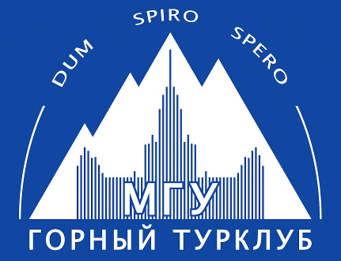

# Горный поход 3 к.с. под руководством Вельтищева М.Н.

Район: Памиро-Алай (Кичик-Алай)

Горный Турклуб МГУ, Москва

# Сводная информация

- Сроки похода: {DATE_START}&nbsp;&mdash; {DATE_END}
- Руководитель: Вельтищев Михаил Николаевич, 2x5ГУ, 3ГР ([dichlofos-mv@yandex.ru](mailto:dichlofos-mv@yandex.ru))
- Тип: горный
- Категория сложности: {CATEGORY_WORD}
- Маршрутная книжка `{MARSH_CIPHER}`, [фотокопия прилагается]({MARSH_LINK})
- Ходовых дней: {ACTIVE_DAYS}
- Протяжённость маршрута: {DISTANCE_ALL} км (GPS, без коэффициентов), в зачёт {DISTANCE_RATED} км
- Максимальная высота: {MAX_HEIGHT} м
- Максимальная высота ночёвки: {MAX_SLEEP} м
- Турклуб: [Горный Турклуб МГУ](https://www.geolink-group.com/tourclub)
- Шифр TLIB: `{TLIB_CIPHER}`
- Отчёт в~[каталоге Вестры]{WESTRA_REPORT_LINK})
- Отчёт на сайте [Горного Турклуба МГУ]({MSU_REPORT_LINK})
- Последнее обновление: {LAST_UPDATE}
- Версия: {VERSION}
- На соревнованиях {CHAMP_TITLE} от {CHAMP_PROTO_DATE} поход занял {CHAMP_PLACE} место, набрав `{CHAMP_RATE}` 
баллов ({CHAMP_COEF} от лидера)
- [Итоговый протокол]({CHAMP_PROTO_LINK}) от {CHAMP_PROTO_DATE} в формате PDF

# Нитка маршрута

{NEEDLE_MD}

**Отличия от плана**: незапланированный участок маршрута (движение по аварийному варианту) представляет собой
транспортировку пострадавшего участника силами группы с лед. Вост. Кумтор в д.р. Зор-Кумтор и последующее
возвращение группы на маршрут по той же долине.

# Отчёт
- Исходный [текст отчёта]({REPO_URL}/source_report_{TRIP_NAME}.md)
- Версия для чтения в формате [Markdown]({REPO_URL}/report_{TRIP_NAME}.md)

- [Копия отчёта]({CHAMP_REPORT_LINK}) в формате PDF + трек с точками, отправленные на {CHAMP_TITLE}.
- Маршрутная книжка: [фотокопия]({MARSH_LINK})
- [Финальная версия отчёта]({REPORT_FINAL_LINK}) для хранения в архиве

# Описания перевалов

Описания перевалов следует брать из сложенных сюда же отчётов (каталог `reports`).

# Фотоматериалы
- Обработанные фотографии к отчёту: каталог `images`

# Треки

Каталог `tracks`:
- полный трек с точками (`tracks/veltishchev/kichik-alay_3ks_2025_veltishchev.gpx`)
- Каталог `tracks/veltishchev/gpsmap` содержат
снятые на местности треки на навигатор Garmin GPSMap 64
- справочно приведены треки Котлярова (2024), Пугаченко (2018) и Двойнева (2016)
в соответствующих подкаталогах

# Замечание об авторских правах

Отчёты, предоставленные здесь, принадлежат их авторам. Приведены для ознакомления
и размещение их здесь не имеет цели нарушить чьи-либо авторские права, тем более,
что они были скопированы из открытых источников.

Тем не менее, если это кого-то смущает, напишите мне, и я выпилю их из репозитория.
